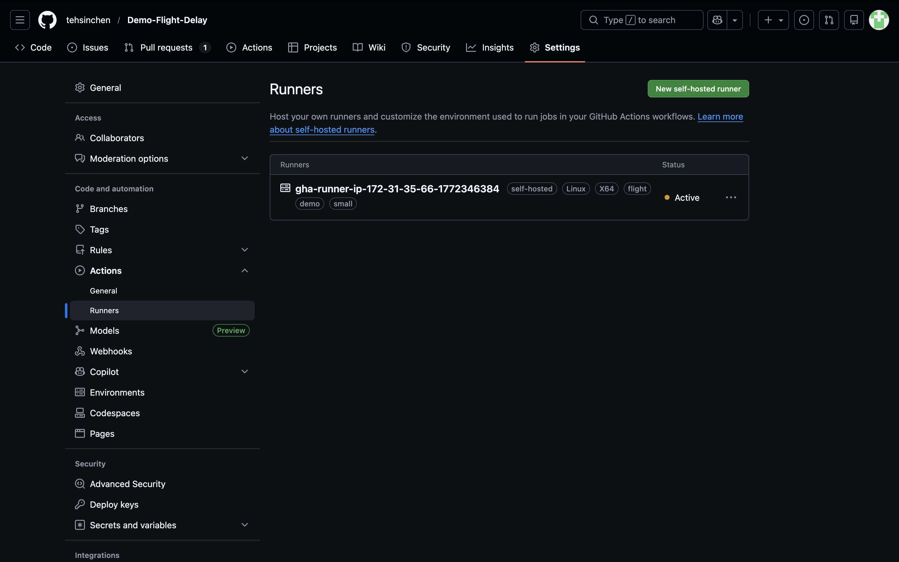
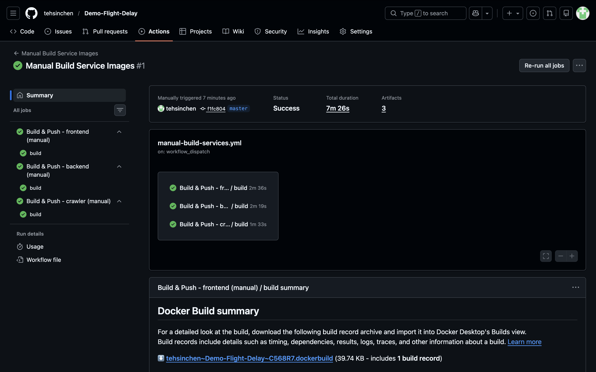
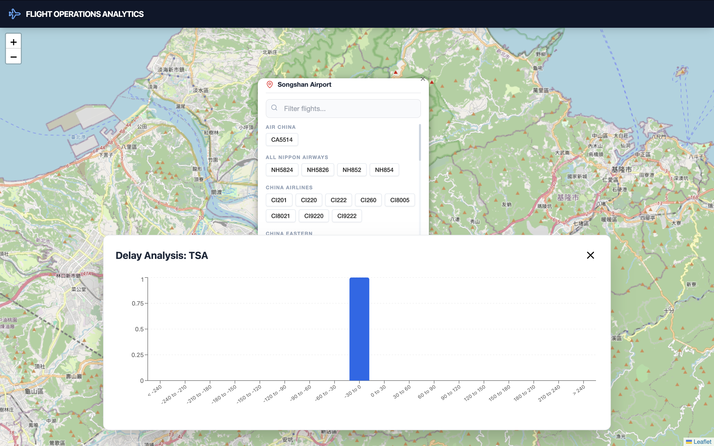
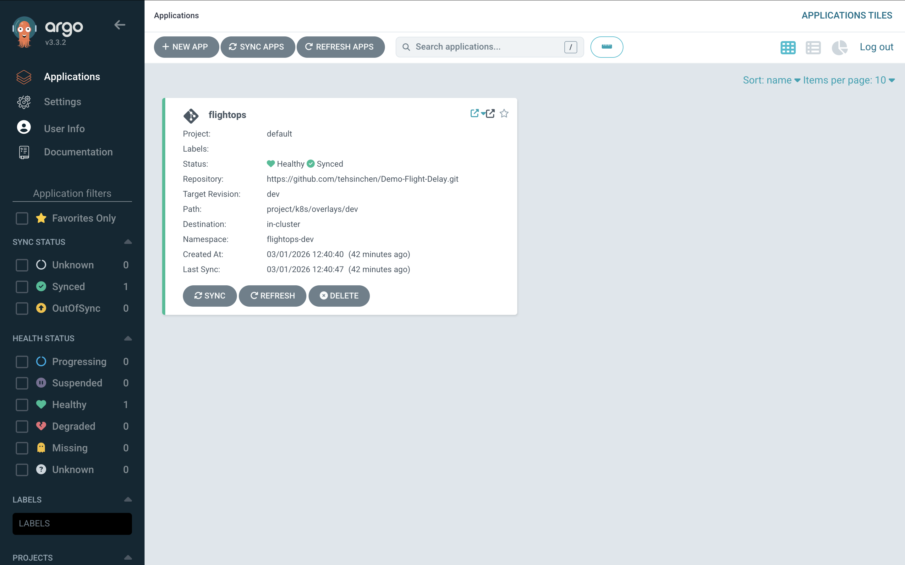
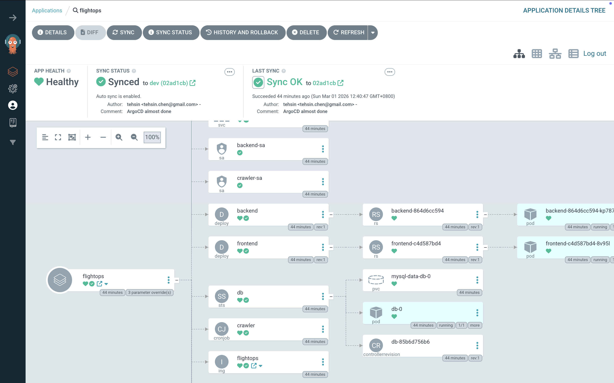
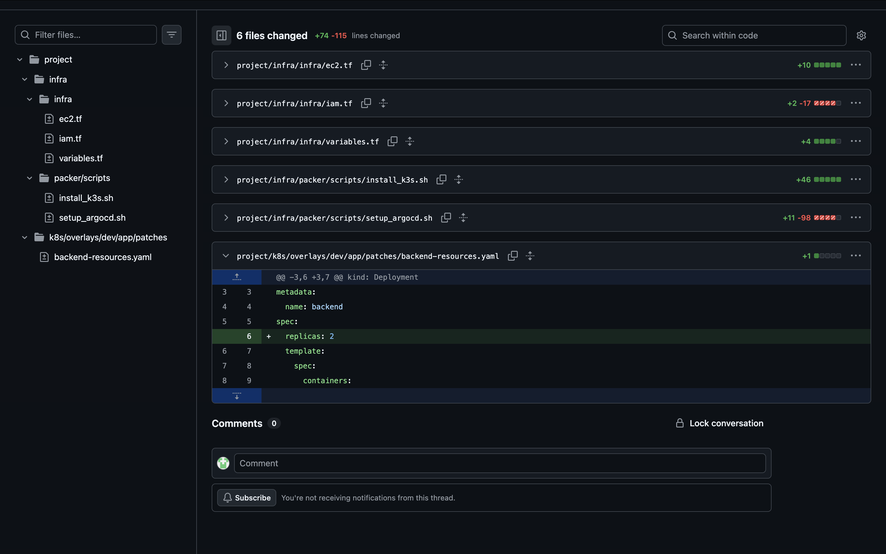
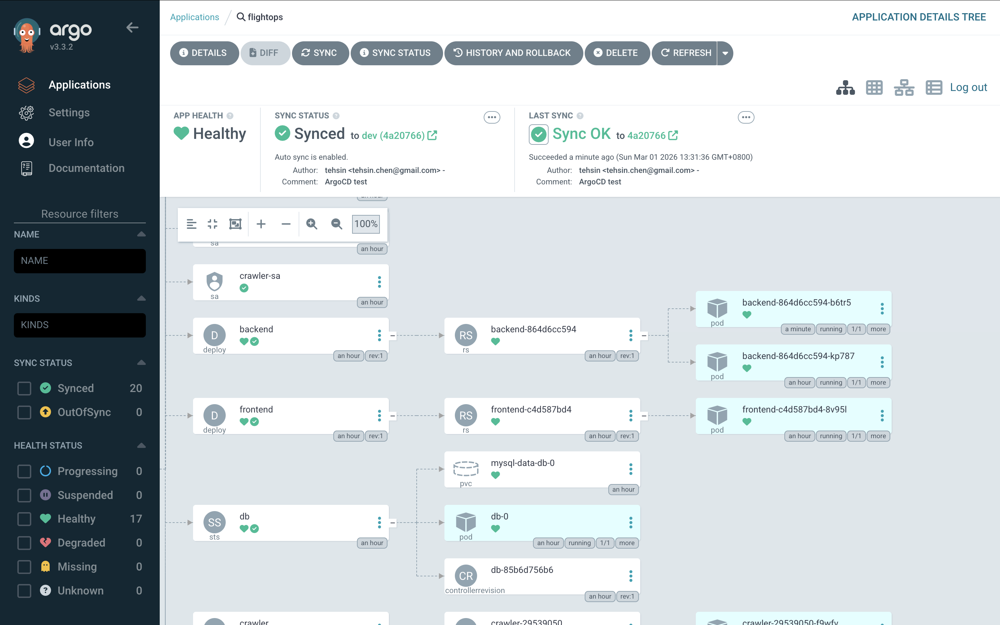

# Demo-Flight-delay (IaC & GitOps)

This project demonstrates a fully automated, Infrastructure as Code (IaC) approach to provisioning a microservices-based application (frontend, backend, and data crawler) on AWS. Everything from the CI/CD runners to the Kubernetes cluster is managed entirely via Terraform, Packer, and ArgoCD.

## Prerequisites
Before deploying the infrastructure, ensure you have the following installed and configured locally:
* AWS CLI (authenticated via aws sso login or your preferred profile)
* Admin access to the target GitHub repository.
* Terraform
* Packer

## Deployment Guide
### Phase 1: Setup GitHub Runner Credentials
To allow EC2 instances to dynamically register as runners, we use a fine-grained GitHub PAT securely stored in AWS Secrets Manager.

#### 1. Generate the PAT (GitHub UI):
* Go to Settings → Developer settings → Personal access tokens → Fine‑grained tokens → Generate new token.
* Name: ec2-runner-register.
* Resource owner: Your organization or user.
* Repository access: Only select repositories -> Pick the target repo.
* Permissions: Administration: Read and write.
* Generate and copy the token (ghp_...).

#### 2. Store PAT in AWS Secrets Manager:
```bash
aws secretsmanager create-secret \
  --name github/ci/runner-settings \
  --secret-string '{
    "github_owner": "YOUR_ORG_OR_USER",
    "github_repo":  "YOUR_REPO",
    "github_pat":   "ghp_XXXXXXXXXXXXXXXXXXXX",
    "runner_labels": "ubuntu-24.04,docker,small",
    "runner_name_prefix": "gha-runner",
    "runner_dir": "/opt/actions-runner"
  }' \
  --region YOUR_REGION \
  --profile YOUR_PROFILE
```

### Phase 2: Deploy Self-Hosted GitHub Runner
#### 1. Bake the Runner AMI:
```bash
cd runner/packer
# Ensure variables in github-runner-ami.pkr.hcl meet your requirements
make init
make build
```

#### 2. Provision the Runner Infrastructure:
```bash
cd ../infra
# Update backend.conf and variables.tf as needed
make init
make apply
```
The runner will automatically retrieve the secret at boot, install dependencies, and register itself to your GitHub repository.


### Phase 3: Deploy Kubernetes Cluster & ArgoCD
#### 1. Bake the k3s + ArgoCD AMI:
```bash
cd project/infra/packer
# Ensure variables in al2023-k3s-argocd.pkr.hcl meet your requirements
make init
make build
```

#### 2. Provision the k3s Infrastructure:
```bash
cd ../infra
# Update backend.conf and variables.tf as needed
make init
make apply
```

### Phase 4: Bootstrap Application Images (CI/CD)
>⚠️ **Important Bootstrapping Note**:
Upon initial deployment, the ArgoCD pods for the application will sit in an ErrImagePull state. This is expected GitOps behavior because the infrastructure has provisioned the deployment manifests, but the actual Docker images have not yet been built and pushed to the newly created ECR repositories.

#### To resolve this and bring the app online:
1. Navigate to your repository's Actions tab on GitHub.
2. Select the Manual Build Service Images workflow.
3. Click Run workflow and select "all" services.
4. Wait for the pipeline to build and push images to ECR.
5. Once complete, you can manually delete the failing pods to trigger an immediate repull.



## Accessing the Application
Once everything is green, the resources are exposed via the public IP of the k3s EC2 instance (outputted by Terraform).
#### Application Frontend: `http://<public-ip>/`


#### ArgoCD UI: `http://<public-ip>/argocd`
To retrieve the initial ArgoCD Admin Password:</br>
Connect to the EC2 instance via AWS SSM Session Manager and run:
```bash
kubectl -n argocd get secret argocd-initial-admin-secret -o jsonpath='{.data.password}' | base64 -d; echo
```
Username is `admin`.




#### GitOps
Since `ApplyOutOfSyncOnly` is set to `true`, Argocd will sync only out-of-sync resources



## Useful Commands for Debugging
Since SSH is disabled, use AWS SSM to connect to the instances to run these commands.

#### Instance Bootstrapping & Cloud-Init:
```bash
cat /var/log/cloud-init.log
cat /var/log/cloud-init-output.log
```

#### ArgoCD:
```bash
kubectl -n argocd get pods
kubectl -n argocd get svc,ingress
kubectl -n argocd logs deploy/argocd-server -n argocd --tail=20
kubectl -n argocd get applications.argoproj.io flightops
```

#### Kubernetes (k3s):
```bash
kubectl -n flightops-dev get pods
```